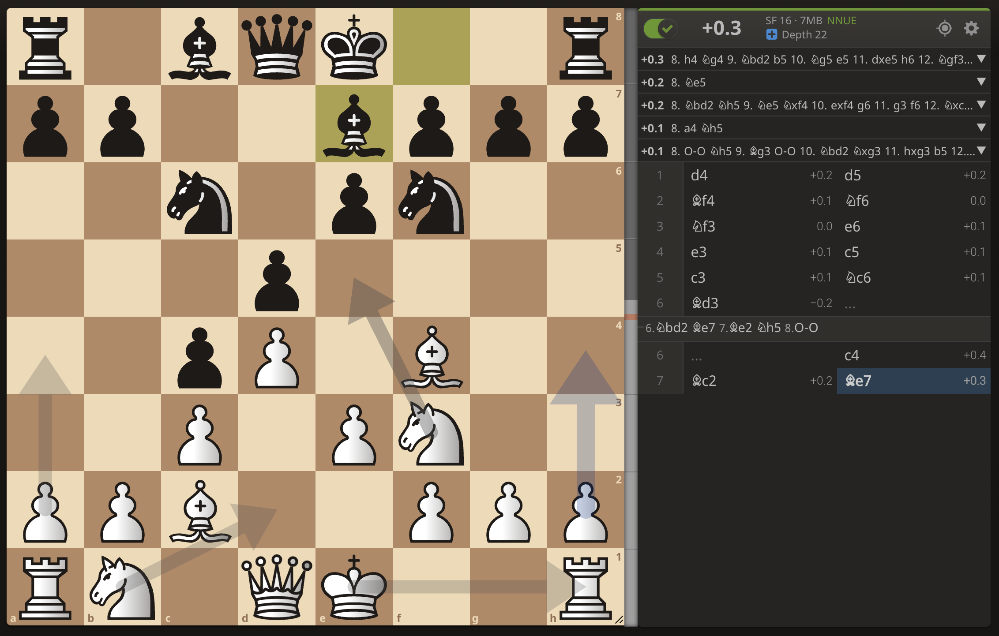

# IOS-Chess-Apps

## Table of Contents
- [Introduction](#introduction)
- [Chess Openings](#app-1-chess-openings)
- [MasterChess](#app-2-masterchess)
- [Webscraper](#webscraper)
- [Installation](#installation)

## Introduction
This repository has code for two IOS chess apps, Chess Openings and MasterChess. I was driven to create these apps out of curiosity of for learning how to make IOS apps and to learn a new coding language.   

These apps are written in Apple's Swift language. The Chess Openings app utilizes Swift SceneKit, which offers a more object-oriented approach to coding a game. The MasterChess app uses SwiftUI, which is a more declarative and less object-oriented language that offers automatic state changes and more recent Apple support.   

Although these apps are not published on the App Store, they are functional and they can be easily compiled and downloaded onto a live or simulated Apple device using Xcode on MacOS.

## App #1: Chess Openings
### Overview
The Chess Openings app was created to offer users a way to memorize chess openings in three different ways.   

The first mode is the "Learn" mode, where users can click through positions on a chess board in order understand different move orders.    

The second mode is the "Survival" mode, where users can test what they learned and try to constantly guess move-orders until their three lives run out.    

The third and final mode is the "Analysis" mode, which gives users the ability to set up positions on a chess board, and then use the Lichess API to return the best move in the position.

### Code Description
### Sample Usage
(((Put videos here)))


https://github.com/will-becht/IOS-Chess-Apps/assets/172098082/931f8060-ae31-49d7-9eae-c1053351a839


https://github.com/will-becht/IOS-Chess-Apps/assets/172098082/09b16e9b-4396-45fb-9f99-c72b9b89b302


https://github.com/will-becht/IOS-Chess-Apps/assets/172098082/7925be42-bfee-4f4a-ae1f-36e2368e0065


https://github.com/will-becht/IOS-Chess-Apps/assets/172098082/d297bbd8-df24-4fe1-9b44-04704adac7bb


## App #2: MasterChess
The MasterChess app was created to bring users more abstract ways to learn chess. It offers modes allowing users to "Play Blind", without seeing a chess board; "Visualize" to allow users to test their short-term memory by converting a list of moves to an on-board position; and "Coordinate Practice" to help users develop a better instinct for the names of each square to aid in their visualization skills.   

The app is largely unfinished. Its main functionality lies in the Visualize and Coordinates modes.

### Overview
### Code Description
### Sample Usage
(((Put videos here)))


https://github.com/will-becht/IOS-Chess-Apps/assets/172098082/059ab0ab-6bef-4193-aeaf-02e09ee38cc7


https://github.com/will-becht/IOS-Chess-Apps/assets/172098082/71f2109d-dff2-40a0-bcb0-d5d8d84d388d


https://github.com/will-becht/IOS-Chess-Apps/assets/172098082/c826da4f-089e-4d31-9e80-96b7dc37b823


## Webscraper
### Overview
The moveScraper directory contains a Python-based webscraper that was used to collect various move orders for this app. In order to speed up the runtime of the app, I decided to avoid the use of a real-time chess engine. Instead, I could run the engine on the specific sets of moves I was interested in ahead of time, so that they could be quickly reused. This webscraper works by navigating to Lichess.com's analysis board, and plugging a position into its cloud-based chess engine that searches positions to a high depth and has many cached positions for quick responses as well. This allowed me to create lists of many move orders for use in the apps.   



In the future, it would be nice to develop a way to have the app interface with popular chess engines, such as Stockfish (https://stockfishchess.org/). This would allow for analysis of random positions that are not included in the list of pre-analyzed positions.


## Installation
To install the Xcode which is required to compile this project, follow this tutorial:
https://developer.apple.com/documentation/safari-developer-tools/installing-xcode-and-simulators

To install the code for this project, follow these steps:

1. Clone the repository:
   ```bash
   git clone https://github.com/will-becht/IOS-Chess-Apps
